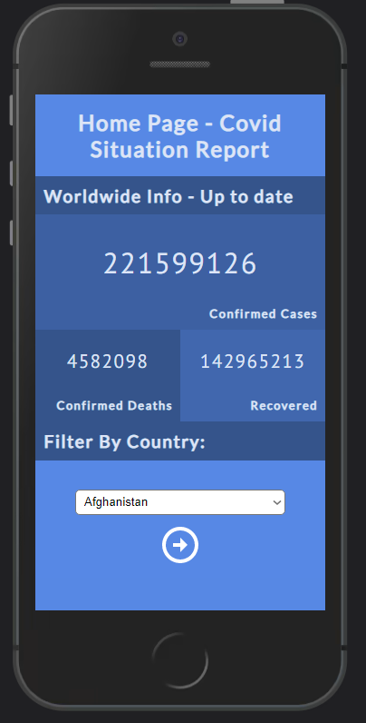

# React-Redux Capstone Project - Covid Information System

> This is a Single Page App for Mobile that shows informations about the Covid crisis.

In this project you can see informations about how the Covid crisis has been in the world since it's start, you can also filter to see this and more information about one single country.

## Built With

- React
- Redux
- Git
- GitHub
- VScode

## Live Demo

[Live Demo Link](https://livedemo.com)

## Getting Started

To get a local copy up and running follow these simple example steps.

### Prerequisites

- Git & GitHub
- CommandLine
- Browser
### Setup

- To setup this project locally you need to choose where to clone this repository.
- Then please open your commandLine and use the following command: 
`git clone https://github.com/jmontanholi/react-capstone-covid.git`
- Travel to that directory and open the files
### Install

- To install you need to run `npm install` or `yarn install` depending on your preference.
### Usage

- In order to use this app locally just use `npm start` or `yarn install` depending on your preference.
### Run tests

- To run tests just run `npm test` or `yarn test` depending on your preference.
## Authors

👤 **João Vítor Montanholi Nunes**

- GitHub: [jmontanholi](https://github.com/jmontanholi)
- Twitter: [MontanholiNunes](https://twitter.com/MontanholiNunes)
- LinkedIn: [Joao vitor montanholi](https://www.linkedin.com/in/joaovitormontanholi/)

## 🤝 Contributing

Contributions, issues, and feature requests are welcome!

Feel free to check the [issues page](../../issues/).

## Show your support

Give a ⭐️ if you like this project!

## Acknowledgments

- Microverse 
- The original design, which inspirate this project is from Nelson Sakwa, you can see his design [here](https://www.behance.net/gallery/31579789/Ballhead-App-(Free-PSDs))

## 📝 License

This project is [MIT](./MIT.md) licensed.
